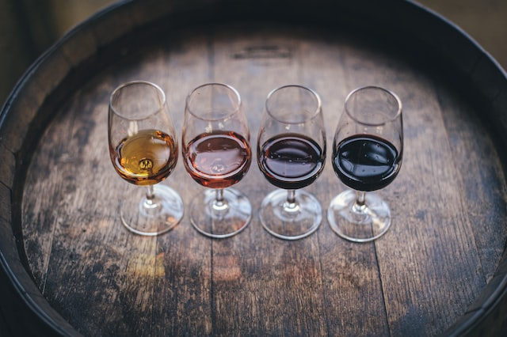

# Design a Prod-Ready API :building_construction: 

# 

## Table of Contents
1. [Project Structure](docs/chapters/chapter_1.md)
2. [Starting with Connexion / Specs First](docs/chapters/chapter_2.md)
3. [Understanding  OpenAPI Specs Standard](docs/chapters/chapter_3.md)
4. [Implementing all  Services](docs/chapters/chapter_4.md)
5. [Enforcing Security](docs/chapters/chapter_5.md)
6. [Writing Unit Testing](docs/chapters/chapter_6.md)
7. [Ensuring Linting & Type Checking](docs/chapters/chapter_7.md)
8. [Packaging with Setup.py](docs/chapters/chapter_8.md)
9. [Automate Integration/Deployment & Learning](docs/chapters/chapter_9.md)
10. [Going Further !](docs/chapters/chapter_10.md)

 
 

## :mag: Overview 

 

This tutorial will guide you through a clear roadmap to design a ready-to-use Python API that meets the basic industry standards. Although brief, it includes exercises, reflection points, and suggestions for improving upon the essentials.

 - By the end of this tutorial, one should  be able to  
    - Plan for an API Design before its implementation (Specs first) 
    - Secure an API
    - Enable logging for traceability
    - Ensure Quality of code
    - Understand the Continuous Integration and Deployment Process ( Github Action )
  
 
 

## :memo: Case Study

 

Since an API seeks to provide useful services to its end users, it is imperative to start with a working program/code in an experimental context. For our part, we decided to design the **Wine Quality Predictor** API ( :wine_glass: ) whose functional   prototype can be viewed [here](https://github.com/architjen/Orness_DS_training). 

  
 
 

## :checkered_flag: Pre-Requisites 

 

- A basic understanding of **Python 3** is required to follow this tutorial
- A good IDE  ( Pycharm / Visual Code/ IntelliJ  ... )
- A GitHub Account 
- And that's it ! Really :innocent: 

 
 

---

[Get Started ( Project Structure ) >>](docs/chapters/chapter_1.md)