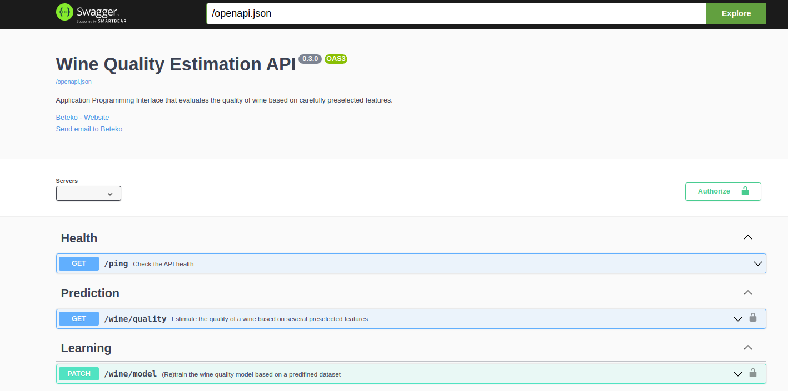

# 1. Project structure :triangular_ruler:

:house: [Overview](../../README.md)

<br>
<br>


## The end in mind 

<br>

Let's cheat a bit and get a  view into the target project structure and swagger UI ...

<details>
  <summary>Target Project Tree Structure</summary>

```
.
├── .github
│   └── workflows
│       ├── ci.yaml  
│       ├── cd.yaml    
│       └── cl.yaml 
│   
├── dataset
│   └── winequality.csv 
│
├── src
│   │ 
│   ├──wine_predictor_api
│   │   ├── security
│   │   │   └── authentication.py 
│   │   ├── services
│   │   │   ├── healthcheck.py
│   │   │   ├── learner.py 
│   │   │   └── predictor.py
│   │   └── specs
│   │       └── openapi_spec.yaml
│   └── tests
│       ├── assets
│       │   ├── sample_data.csv   
│       │   └── test_model.jl  
│       ├── conftest.py  
│       ├── test_healthcheck.py 
│       ├── test_learner.py 
│       └── test_predictor.py 
│
├── .gitignore
├── config.template.json
├── launcher.sh 
├── logging.yaml
├── MANIFEST.in 
├── README.md 
├── dev-requirements.txt 
├── requirements.txt 
├── setup.cfg
├── setup.py
└── VERSION    


```
</details>


<details>
  <summary>Target Swagger UI</summary>



</details>


<br>
<br>

## First thing First ...

<br>

Let's create the basic blueprint of our project.

- Create a new repository **wine-predictor-api** on your personal github  ( including a README.md and **.gitignore** )

- Then clone that repository on your local machine 
    ```
    git clone https://github.com/<my-private-git-account>/wine-predictor-api.git
    ```

-  Browse into your folder **wine-predictor-api** then create and checkout into a feature branch `init`
    ```
    cd wine-predictor-api/
    git checkout -b init
    ```
- Create a virtual environment  **venv** 
    ```
    python -m venv venv 
    ```
- Create the below initial project tree

    ```
    .
    │   
    ├── dataset
    │   └── winequality.csv 
    │
    ├── src
    │   └── wine_predictor_api
    │       └── __init__.py 
    │
    ├── venv 
    ├── .gitignore    
    ├── requirements.txt
    ├── README.md  
    └── VERSION 
    ```

Initializing them with : 
 - content of **dataset/winequality.csv** can be downloaded [here](../assets/winequality.csv)

 - **.gitignore** file content can be replaced by the generic Python .gitignore found [here](https://github.com/github/gitignore/blob/main/Python.gitignore)

 -  Below is the content of the **VERSION** file 
    ```
    0.1.0
    ```
 -  All other files can be left as such


<br>
<br>

---

[ << ( Overview ) ](../../README.md)  &nbsp;&nbsp; |  &nbsp;&nbsp;  [ ( 2. Starting with Connexion ) >>](../chapters/chapter_2.md)  
 
 
