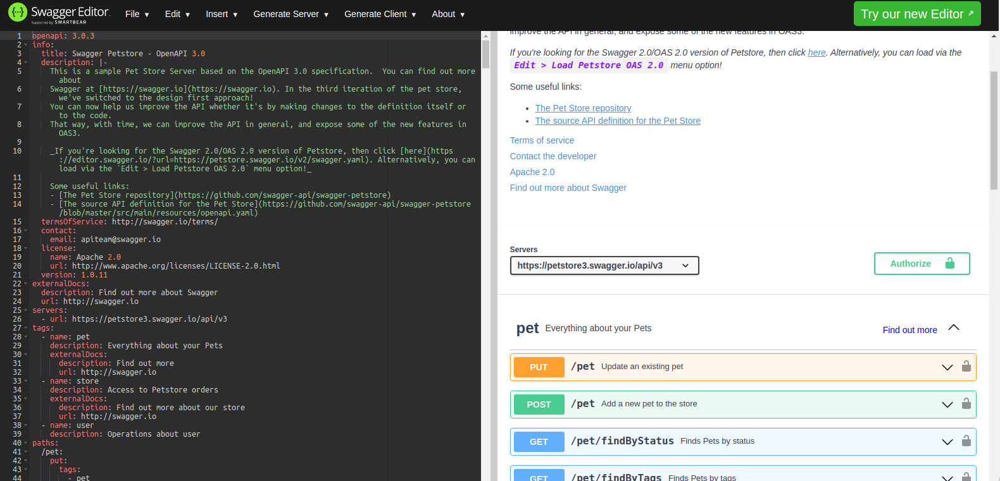

# 3. Understanding OpenAPI Specs Standard :scroll:

:house: [Overview](../../README.md)

Formerly known as Swagger specs (v2.0.0) Open API  Specification (OAS) is a standard used to document a Restful APIs. 
It is represented in JSON or YAML  and has a well-defined structure that evolves according to the version. 

<br>
<br>

## OpenApi Specs Structure

<br>

Below are the basic blocks  of an OpenAPI spec 

<details>

<summary> <b>Openapi Version</b></summary>

  Provide the Open API Version to use.

  ```YAML
  openapi: 3.0.0
  ```
</details>


<details>
<summary> <b>Info</b></summary>

  Provide the metadata of the API.

  ```YAML
  info:
    title: Swagger Petstore - OpenAPI 3.0
    description: |-
      This is a sample Pet Store Server based on the OpenAPI 3.0 specification. 
      
    termsOfService: http://swagger.io/terms/
    contact:
      email: apiteam@swagger.io
    license:
      name: Apache 2.0
      url: http://www.apache.org/licenses/LICENSE-2.0.html
    version: 1.0.11
  
  ```

  More details [here](https://swagger.io/specification/#info-object)

</details>


<details>
  <summary> <b>Servers</b></summary>

  Provide the list of target servers. ( Default is **/** )


  ```YAML
  servers:
    - url: https://test.petstore3.swagger.io/api/v3
    - url: https://uat.petstore3.swagger.io/api/v3
    - url: https://prod.petstore3.swagger.io/api/v3
  
  ```
  
  More details [here](https://swagger.io/specification/#server-object)

</details>


<details>
  <summary> <b>Path</b></summary>

  List of all the endpoints along with their routes, method , description, request and response schema. 

  ```YAML
  paths:
    /ping:
      get:
        summary: Get an object from ...
        security: []
        tags: [Health]
        operationId: checkStatus
        responses:
          '200':
            description: API is up and running
  
  ```

  More details [here](https://swagger.io/specification/#paths-object)

</details>

<details>
  <summary> <b>Tags</b></summary>
  A list of tags used to group all endpoints performing the same business logic.

  ```YAML
  tags:
    - name: health
    description: Everything about your Pets
    externalDocs:
      description: Find out more
      url: http://swagger.io

    - name: store
      description: Access to Petstore orders

    - name: user
  
  ```

  More details [here](https://swagger.io/specification/#tag-object)
</details>

<details>
  <summary> <b>Components</b></summary>
  
  More details [here](https://swagger.io/specification/#components-object)
</details>

<details>
  <summary> <b>SecuritySchemes</b></summary>

  A List of  all security mechanisms that can be used across the API. Under the **components** object

  ```YAML
  components:
    securitySchemes:
      basicAuth:
        type: http
        scheme: basic
  ```

  More details [here](https://swagger.io/specification/#security-requirement-object)
</details>


<details>
  <summary> <b>ExternalDocs</b></summary>

  Provide external documentation beyond the Swagger UI.
 
  ```YAML
  externalDocs:
    description: Find out more about my API
    url: http://swagger.io
  ```

  More details [here](https://swagger.io/specification/#external-documentation-object)
</details>

<br>
<br>

## Basic example 

<br>

```yaml
  openapi: 3.0.0
  info:
    title: Basic Auth Example
    version: '1.0'
  servers:
    - url: /openapi
  paths:
    /secret:
      get:
        summary: Return secret string
        operationId: app.get_secret
        responses:
          '200':
            description: secret response
            content:
              '*/*':
                schema:
                  type: string
        security:
          - basic: []
  components:
    securitySchemes:
      basic:
        type: http
        scheme: basic
        x-basicInfoFunc: app.basic_auth

```

<br>
<br>

## Customization 

<br>

It is possible to integrate your custom field beside the defined standard. You only need to start with  prefix your variable key 
with `x-`. 

Example: 
  - `x-token-function`
  - `x-foo` 
  - `x-bar` ...


<br>
<br>

## Visualize as you design

<br>

In order to render your YAML file as you design it kindly use the online tool below.

https://editor.swagger.io/




<br>
<br>

## Make the ** connexion ** !

<br>

**Connexion** framework make use of the field `operationId` ( under the **path** section ) to bind the endpoints with their respective controllers/handlers. 


**Example**: 

```yaml
...
  paths:
    /health:
      get:
        summary: Return secret string
        operationId: services.healthcheck.ping
        responses:
          '200':
            description: secret response
            content:
              '*/*':
                schema:
                  type: string
...

```


 In the example above, all requests sent to the endpoint `[GET] /ping`  will be handled by a controller at   `operationId: services.healthcheck.ping`. Here `ping` is a function within the module `services/healthcheck.py`.    


<br>
<br>

## References 

<br>

- https://editor.swagger.io/
- https://swagger.io/specification/


<br>
<br>

---

[ << ( 2. Starting with Connexion ) ](../chapters/chapter_2.md) &nbsp;&nbsp; |  &nbsp;&nbsp;  [ ( 4. Implementing Services ) >>](../chapters/chapter_4.md)  
 
