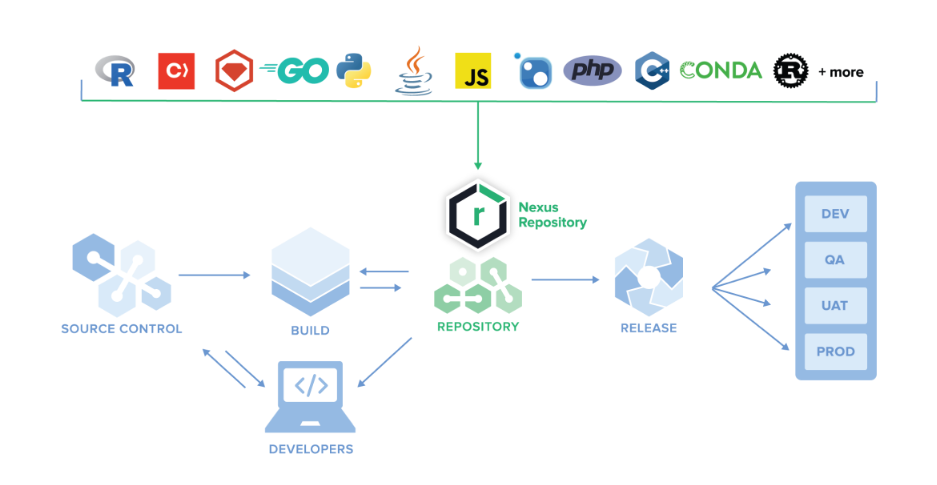

# 8. Packaging with Setup.py  :package:

:house: [Overview](../../README.md)

<br>
<br>

This section seeks to share some lights on the process of generating a python artifact (.wheel, .tar.gz, .zip ) from  source code in view of storing it on a  repository manager such as (JFrog Artifactory, Pulp, Nexus... ) 


**Binary and Build Artifact Manager - Nexus**

image ref: overview  [Nexus](https://www.sonatype.com/products/nexus-repository)

<br>
<br>

## Building the artifact 


<br>


We wil create a  **setup.py** file in the root folder that will specify the parameters to take into account during the build/installation process. 


<details>
    <summary>  <b> ./setup.py</b></summary>

```python 
import os
from setuptools import setup, find_packages


def read_file(fname: str) -> str:
    with open(os.path.join(os.path.dirname(__file__), fname), "r") as f:
        return f.read()


setup(
    name='wine_predictor_api',
    packages=find_packages(where='src', exclude=['tests']),
    package_dir={'': 'src'},
    url='https://github.com/<my-git-account>/wine-predictor-api',
    version=read_file("VERSION"),
    description='My Wine Predictor API Server ',
    long_description=read_file("README.md"),
    author='Beteko',
    keywords=['openapi', 'api', 'swagger'],
    python_requires=">=3.6",
    setup_requires=['wheel'],
    install_requires=read_file("requirements.txt").split("\n"),
    classifiers=[
        'Programming Language :: Python',
        'Programming Language :: Python :: 3.7',
        'Programming Language :: Python :: 3.8',
        'Programming Language :: Python :: 3.9',
        'Programming Language :: Python :: 3.10',
        'Development Status :: 5 - Production/Stable',
        'Intended Audience :: Developers',
        'Topic :: Software Development  :: Application Programming Interface'
    ],
    include_package_data=True

```

</details>

<br>

Then generate the artifacts by executing the command below in your terminal

```shell
$ python setup.py sdist bdist_wheel
```
Here `sdist` stands for sQmineAminource distribution and `bdist` for **Binary Distribution**. Find more [here](https://medium.com/ochrona/understanding-python-package-distribution-types-25d53308a9a)  on Python Package Distribution Types

:information_source: : Make sure that the packages wheel and setuptools are install on your virtual environment

In your root folder, we can view a  new directory **./dist/**  containing two (2) archives with extension `.whl` for **bdist** and `.tar.gz` or `.zip` for **sdist**. 

After opening **sdist** archive, you will notice that the required files below are missing because they are treated as data and not `.py` modules.

- VERSION
- requirements.txt
- dev-requirements.txt
- openapi_spec.yaml

In order to ensure the above files are included in our artifacts, we will introduce the file **MANIFEST.in** in the root folder to explicitly include them 


<details>
    <summary>  <b> ./MANIFEST.in</b></summary>

```txt 
include VERSION
include requirements.txt
include dev-requirements.txt
include src/wine_predictor_api/specs/*.yaml

```
</details>
<br>

Finally re-generate the artifacts and ensure that the data files exists in the artifact.

```shell
$ python setup.py sdist bdist_wheel
```

<br>

:thought_balloon: At this point, I  recommend that you create a Pull Request from your feature branch then merge it to yor main branch.  

<br>

> :camera: Find [here](https://github.com/beteko/wine-predictor-snapshots) the current state of the project 


<br>
<br>

---


[ << ( 7. Ensuring Linting & Type Checking ) ](../chapters/chapter_7.md#linting-with-flake8) &nbsp;&nbsp; |  &nbsp;&nbsp;  [ ( 9. Automation ) >>](../chapters/chapter_9.md) 