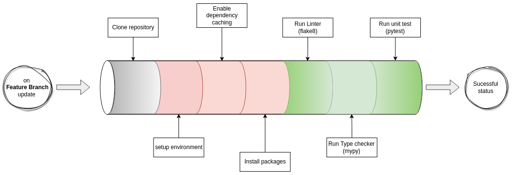
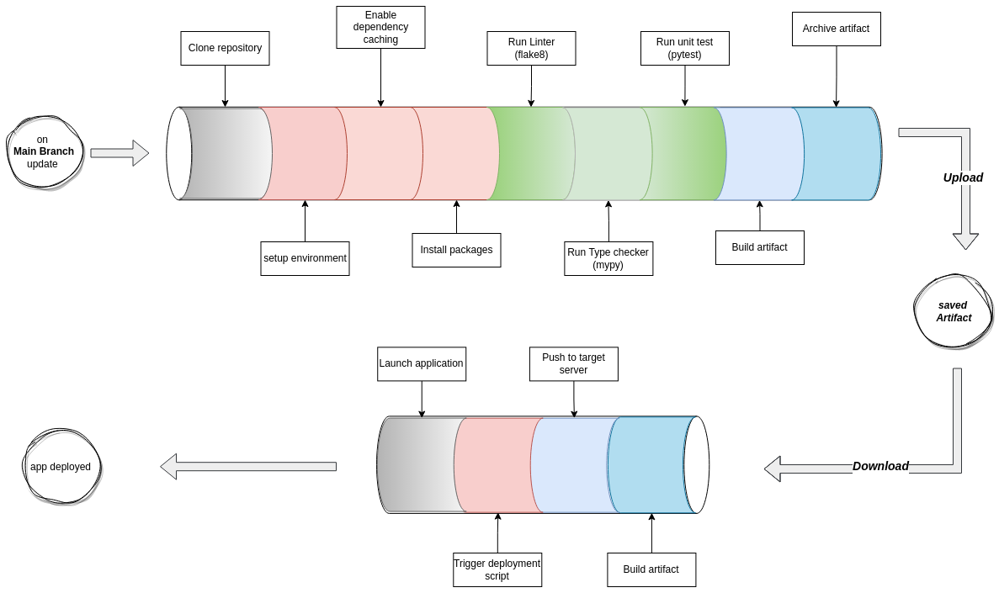

# 9. Automate Integration/Deployment & Learning :robot: 

:house: [Overview](../../README.md)


<br>
<br>


Well done for making it through this chapter :clap: !  This section will discuss the major steps involved in the Continuous Integration, Deployment and Learning. Those automation processes seek to answer the following questions

- How do I ensure that any changes(feat, refactoring ...) to be introduced are free from linting/type related bugs and passes defined unit tests ?
- How do I automate the deployment process on the target servers when all pre-checked changes are validated ? 
- How do I automatically re-train my machine learning model when my company acquires more data ? 


<br>
<br>

## Continuous Integration 



<br>

```yaml
name: Continuous Integration
on:
  push:
    branches: # Run only for feature branches
      - '*'
      - '!main'
jobs:
  test_code:
    name: Test Code
    runs-on: ubuntu-latest
    steps:
      - name: Checkout
        uses: actions/checkout@v2

      - name: Environment Setup
        uses: actions/setup-python@v2
        with:
          python-version: 3.7
          cache: pip

      - name: Cache dependecies
        uses: actions/cache@v2
        with:
          path: ~/.cache/pip
          key: ${{ runner.os }}-pip-${{ hashFiles('**/dev-requirements.txt') }}
          restore-keys: ${{ runner.os }}-pip-

      - name: Install packages
        run: |
          pip install -U pip
          pip install -r dev-requirements.txt
      - name: Run Linter
        run: flake8 src/

      - name: Run Type-Checker
        run: mypy --install-types --non-interactive src/

      - name: Run Unit Tests
        run: pytest -vs
```


<br>
<br>

## Continuous Deployment  

<br>




```yaml

name: Continuous Deployment
on:
  push:
    branches: # Run only on main branch
      - 'main'
jobs:
  test_and_build_code:
    name: Test and Build Code
    runs-on: ubuntu-latest
    steps:
      - name: Checkout
        uses: actions/checkout@v2

      - name: Environment Setup
        uses: actions/setup-python@v2
        with:
          python-version: 3.7
          cache: pip

      - name: Cache dependecies
        uses: actions/cache@v2
        with:
          path: ~/.cache/pip
          key: ${{ runner.os }}-pip-${{ hashFiles('**/dev-requirements.txt') }}
          restore-keys: ${{ runner.os }}-pip-

      - name: Install packages
        run: |
          pip install -U pip
          pip install -r dev-requirements.txt
      - name: Run Linter
        run: flake8 src/

      - name: Run Type-Checker
        run: mypy --install-types --non-interactive src/

      - name: Run Unit Tests
        run: pytest -vs

      - name: Build Artifact
        run: |
          pip install -U wheel setuptools
          python setup.py sdist bdist_wheel
      - name: Archive Artifact
        uses: actions/upload-artifact@v3
        with:
          name: dist-wine-predictor
          path: |
            dist
  deploy_artifact:
    name: Deploy artifact on Target Server
    needs: test_and_build_code
    runs-on: ubuntu-latest
    steps:
      - name: Download Artifact
        uses: actions/download-artifact@v3
        with:
          name: dist-wine-predictor

      - name: Display structure of downloaded files
        run: ls -R

      - name: Push Artifact to Staging server
        uses: easingthemes/ssh-deploy@main
        env:
          SSH_PRIVATE_KEY: ${{ secrets.SSH_PRIVATE_KEY }}
          SOURCE: "."
          REMOTE_HOST: ${{ secrets.REMOTE_HOST }}
          REMOTE_USER: ${{ secrets.REMOTE_USER }}
          TARGET: ${{ secrets.REMOTE_TARGET }}

      - name: Deploy to Staging server
        uses: appleboy/ssh-action@master
        with:
          host: ${{ secrets.REMOTE_HOST }}
          username: ${{ secrets.REMOTE_USER }}
          key: ${{ secrets.SSH_PRIVATE_KEY }}
          script: |
            sh ${{ secrets.REMOTE_DEPLOY_SCRIPT }}
```

<br>
<br>

## Continuous Learning   

<br>

```yaml
name: Continuous Learning
on:
  push:
    branches: # Run only on change in dataset directory from the main branch
      - main
    paths:
      - dataset/**
jobs:
  test_code:
    name: Update Wine Quality Model
    runs-on: ubuntu-latest
    steps:
      - name: Trigger the learning endpoint
        run: |
          curl -X 'PATCH' '${{ secrets.API_BASE_URL }}/wine/model' -H 'Authorization: Basic ${{ secrets.API_AUTH_TOKEN }}'

```

<br>

> :camera: Find [here](https://github.com/beteko/wine-predictor-api) the full project including  CI/ CD & CL files  


<br>
<br>

---

[ << ( 8. Packaging with Setup.py ) ](../chapters/chapter_8.md) &nbsp;&nbsp; |  &nbsp;&nbsp;  [ ( 10. Going Further ! ) >>](../chapters/chapter_10.md)  
 
 